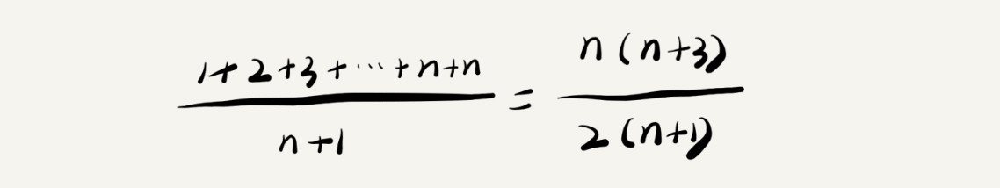

# 数据结构与算法之美

### 开篇词 | 从今天起，跨过“数据结构与算法”这道坎

### 01 | 为什么要学习数据结构和算法？

### 02 | 如何抓住重点，系统高效地学习数据结构与算法？

***什么是数据结构？什么是算法？***

从广义上讲，数据结构就是一组数据的存储结构，算法就是操作数据的一组方法。

从狭义上讲，也就是我们专栏要讲的，是指某些著名的数据结构和算法，比如队列、栈、堆、二分查找、动态规划等。

数据结构和算法是相辅相成的。数据结构是为算法服务的，算法要作用在特定的数据结构之上。 因此，我们无法孤立数据结构来讲算法，也无法孤立算法来讲数据结构。

***学习的重点在什么地方？***

数据结构和算法解决的是如何更省、更快地存储和处理数据的问题，因此，我们就需要一个考量效率和资源消耗的方法，这就是复杂度分析方法。所以，如果你只掌握了数据结构和算法的特点、用法，但是没有学会复杂度分析，那就相当于只知道操作口诀，而没掌握心法。只有把心法了然于胸，才能做到无招胜有招！

在学习数据结构和算法的过程中，你也要注意，不要只是死记硬背，不要为了学习而学习，而是要学习它的“来历”“自身的特点”“适合解决的问题”以及“实际的应用场景”。

学习数据结构和算法的过程，是非常好的思维训练的过程，所以，千万不要被动地记忆，要多辩证地思考，多问为什么。

***一些可以让你事半功倍的学习技巧***

边学边练，适度刷题

多问、多思考、多互动

打怪升级学习法

知识需要沉淀，不要想试图一下子掌握所有

### 03 | 复杂度分析（上）：如何分析、统计算法的执行效率和资源消耗？

***为什么需要复杂度分析？***

**事后统计法**

我把代码跑一遍，通过统计、监控，就能得到算法执行的时间和占用的内存大小。

测试结果非常依赖测试环境

测试结果受数据规模的影响很大

我们需要一个不用具体的测试数据，就可以粗略地估计算法的执行效率的方法。这就是我们今天要讲的时间、空间复杂度分析方法。

***大 O 复杂度表示法***

所有代码的执行时间 T(n) 与每行代码的执行次数 n 成正比。


T(n) 我们已经讲过了，它表示代码执行的时间；n 表示数据规模的大小；f(n) 表示每行代码执行次数的总和。因为这是一个公式，所以用 f(n) 来表示。公式中的 O，表示代码的执行时间 T(n) 与 f(n) 表达式成正比。

大 O 时间复杂度实际上并不具体表示代码真正的执行时间，而是表示代码执行时间随数据规模增长的变化趋势，所以，也叫作渐进时间复杂度（asymptotic time complexity），简称时间复杂度。

而公式中的低阶、常量、系数三部分并不左右增长趋势，所以都可以忽略，我们只需要记录一个最大量级就可以了。

***时间复杂度分析***

只关注循环执行次数最多的那一段代码

加法法则：总复杂度等于量级最大的那段代码的复杂度

乘法法则：嵌套代码的复杂度等于嵌套内外代码复杂度的乘积

***几种常见时间复杂度实例分析***


对于刚罗列的复杂度量级，我们可以粗略地分为两类，多项式量级和非多项式量级。其中，非多项式量级只有两个：O($2^n$) 和 O(n!)。

当数据规模 n 越来越大时，非多项式量级算法的执行时间会急剧增加，求解问题的执行时间会无限增长。所以，非多项式时间复杂度的算法其实是非常低效的算法。

**O(1)**

只要代码的执行时间不随 n 的增大而增长，这样代码的时间复杂度我们都记作 O(1)。或者说，一般情况下，只要算法中不存在循环语句、递归语句，即使有成千上万行的代码，其时间复杂度也是Ο(1)。

**O(logn)、O(nlogn)**

```java
i = 1;
while (i <= n) {
  i = i * 2;
}
```

实际上，变量 i 的取值就是一个等比数列。


所以，我们只要知道 x 值是多少，就知道这行代码执行的次数了。

x=$log_2 n$，所以，这段代码的时间复杂度就是 O($log_2 n$)。

实际上，不管是以 2 为底，还是以 3 为底，我们可以把所有对数阶的时间复杂度都记为 O(logn)。

对数之间是可以互相转换的，$log_3 n$ 就等于 $log_3 2$ * $log_2 n$，所以 O($log_3 n$) = O(C * $log_2 n$)，其中 C=$log_3 2$ 是一个常量。

**O(m+n)、O(m*n)**

代码的复杂度由两个数据的规模来决定。

***空间复杂度分析***

空间复杂度全称就是渐进空间复杂度（asymptotic space complexity），表示算法的存储空间与数据规模之间的增长关系。

我们常见的空间复杂度就是 O(1)、O(n)、O($n^2$ )，像 O(logn)、O(nlogn) 这样的对数阶复杂度平时都用不到。

***复杂度图表***


### 04 | 复杂度分析（下）：浅析最好、最坏、平均、均摊时间复杂度

***最好、最坏情况时间复杂度***

最好情况时间复杂度就是，在最理想的情况下，执行这段代码的时间复杂度。就像我们刚刚讲到的，在最理想的情况下，要查找的变量 x 正好是数组的第一个元素，这个时候对应的时间复杂度就是最好情况时间复杂度。

最坏情况时间复杂度就是，在最糟糕的情况下，执行这段代码的时间复杂度。就像刚举的那个例子，如果数组中没有要查找的变量 x，我们需要把整个数组都遍历一遍才行，所以这种最糟糕情况下对应的时间复杂度就是最坏情况时间复杂度。

***平均情况时间复杂度***

要查找的变量 x 在数组中的位置，有 n+1 种情况：在数组的 0～n-1 位置中和不在数组中。我们把每种情况下，查找需要遍历的元素个数累加起来，然后再除以 n+1，就可以得到需要遍历的元素个数的平均值，即：



我们刚讲的这 n+1 种情况，出现的概率并不是一样的。

我们知道，要查找的变量 x，要么在数组里，要么不在数组里。这两种情况对应的概率统计起来很麻烦，为了方便你理解，我们假设在数组中与不在数组中的概率都为 1/2。另外，要查找的数据出现在 0～n-1 这 n 个位置的概率也是一样的，为 1/n。所以，根据概率乘法法则，要查找的数据出现在 0～n-1 中任意位置的概率就是 1/(2n)。

如果我们把每种情况发生的概率也考虑进去，那平均时间复杂度的计算过程就变成了这样：


这个值就是概率论中的加权平均值，也叫作期望值，所以平均时间复杂度的全称应该叫加权平均时间复杂度或者期望时间复杂度。

***均摊时间复杂度***

对一个数据结构进行一组连续操作中，大部分情况下时间复杂度都很低，只有个别情况下时间复杂度比较高，而且这些操作之间存在前后连贯的时序关系，这个时候，我们就可以将这一组操作放在一块儿分析，看是否能将较高时间复杂度那次操作的耗时，平摊到其他那些时间复杂度比较低的操作上。而且，在能够应用均摊时间复杂度分析的场合，一般均摊时间复杂度就等于最好情况时间复杂度。

### 05 | 数组：为什么很多编程语言中数组都从 0 开始编号？

***如何实现随机访问？***

数组（Array）是一种**线性表**数据结构。它用一组**连续的内存空间**，来存储一组具有**相同类型的数据**。

计算机会给每个内存单元分配一个地址，计算机通过地址来访问内存中的数据。当计算机需要随机访问数组中的某个元素时，它会首先通过下面的寻址公式，计算出该元素存储的内存地址：

```c
a[i]_address = base_address + i * data_type_size
```

其中 data_type_size 表示数组中每个元素的大小。

***低效的“插入”和“删除”***

**插入操作**

如果数组中存储的数据并没有任何规律，数组只是被当作一个存储数据的集合。在这种情况下，如果要将某个数据插入到第 k 个位置，为了避免大规模的数据搬移，我们还有一个简单的办法就是，直接将第 k 位的数据搬移到数组元素的最后，把新的元素直接放入第 k 个位置。

利用这种处理技巧，在特定场景下，在第 k 个位置插入一个元素的时间复杂度就会降为 O(1)。

**删除操作**

在某些特殊场景下，我们并不一定非得追求数组中数据的连续性。

每次的删除操作并不是真正地搬移数据，只是记录数据已经被删除。当数组没有更多空间存储数据时，我们再触发执行一次真正的删除操作，这样就大大减少了删除操作导致的数据搬移。

***警惕数组的访问越界问题***

数组越界在 C 语言中是一种未决行为，并没有规定数组访问越界时编译器应该如何处理。因为，访问数组的本质就是访问一段连续内存，只要数组通过偏移计算得到的内存地址是可用的，那么程序就可能不会报任何错误。

***容器能否完全替代数组？***

Java ArrayList 最大的优势就是可以将很多数组操作的细节封装起来（内存申请和数据搬移操作）。另外，它还有一个优势，就是支持动态扩容。

Java ArrayList 无法存储基本类型，比如 int、long 需要封装为 Integer、Long 类，而 Autoboxing、Unboxing 则有一定的性能消耗，所以如果特别关注性能，或者希望使用基本类型，就可以选用数组。

如果数据大小事先已知，并且对数据的操作非常简单，用不到 ArrayList 提供的大部分方法，也可以直接使用数组。

当要表示多维数组时，用数组往往会更加直观。

***解答开篇***

从数组存储的内存模型上来看，“下标”最确切的定义应该是“偏移（offset）”。如果用 a 来表示数组的首地址，a[0] 就是偏移为 0 的位置，也就是首地址，a[k] 就表示偏移 k 个 type_size 的位置，所以计算 a[k] 的内存地址只需要用这个公式：

```c
a[k]_address = base_address + k * type_size
```

但是，如果数组从 1 开始计数，那我们计算数组元素 a[k] 的内存地址就会变为：

```c
a[k]_address = base_address + (k-1) * type_size
```

从 1 开始编号，每次随机访问数组元素都多了一次减法运算，对于 CPU 来说，就是多了一次减法指令。

C 语言设计者用 0 开始计数数组下标，之后的 Java、JavaScript 等高级语言都效仿了 C 语言，或者说，为了在一定程度上减少 C 语言程序员学习 Java 的学习成本，因此继续沿用了从 0 开始计数的习惯。

### 06 | 链表（上）：如何实现 LRU 缓存淘汰算法?

***五花八门的链表结构***

**单链表**

**循环链表**

和单链表相比，循环链表的优点是从链尾到链头比较方便。当要处理的数据具有环型结构特点时，就特别适合采用循环链表。比如著名的约瑟夫问题，尽管用单链表也可以实现，但是用循环链表实现的话，代码就会简洁很多。

**双向链表**

从结构上来看，双向链表可以支持 O(1) 时间复杂度的情况下找到前驱结点，正是这样的特点，也使双向链表在某些情况下的插入、删除等操作都要比单链表简单、高效。

*删除操作*

在实际的软件开发中，从链表中删除一个数据无外乎这两种情况：删除结点中“值等于某个给定值”的结点；删除给定指针指向的结点。

对于第一种情况，不管是单链表还是双向链表，为了查找到值等于给定值的结点，都需要从头结点开始一个一个依次遍历对比，直到找到值等于给定值的结点，然后再通过指针操作将其删除。

尽管单纯的删除操作时间复杂度是 O(1)，但遍历查找是主要的耗时点，对应的时间复杂度为 O(n)。

对于第二种情况，我们已经找到了要删除的结点，但是删除某个结点 q 需要知道其前驱结点，而单链表并不支持直接获取前驱结点，所以，为了找到前驱结点，我们还是要从头结点开始遍历链表，直到 p->next=q，说明 p 是 q 的前驱结点。

但是对于双向链表来说，这种情况就比较有优势了。因为双向链表中的结点已经保存了前驱结点的指针，不需要像单链表那样遍历。所以，针对第二种情况，单链表删除操作需要 O(n) 的时间复杂度，而双向链表只需要在 O(1) 的时间复杂度内就搞定了！

***链表 vs 数组性能大比拼***

数组简单易用，在实现上使用连续的内存空间，可以借助 CPU 的缓存机制预读数组中的数据，所以访问效率更高。而链表在内存中并不是连续存储，所以对 CPU 缓存不友好，没办法有效预读。

数组的缺点是大小固定，一经声明就要占用整块连续的内存空间。如果声明的数组过大，系统可能没有足够的连续内存空间分配给它，导致“内存不足（out of memory）”。如果声明的数组过小，则可能出现不够用的情况，这时只能再申请一个更大的内存空间，把原数组拷贝进去，非常费时。链表本身没有大小的限制，天然地支持动态扩容。

除此之外，如果你的代码对内存的使用非常苛刻，那数组就更适合你。因为链表中的每个结点都需要消耗额外的存储空间去存储一份指向下一个结点的指针，所以内存消耗会翻倍。而且，对链表进行频繁的插入、删除操作，还会导致频繁的内存申请和释放，容易造成内存碎片，如果是 Java 语言，就有可能会导致频繁的 GC（Garbage Collection，垃圾回收）。

***解答开篇***

**如何基于链表实现 LRU 缓存淘汰算法**

我们维护一个有序单链表，越靠近链表尾部的结点是越早之前访问的。当有一个新的数据被访问时，我们从链表头开始顺序遍历链表。

如果此数据之前已经被缓存在链表中了，我们遍历得到这个数据对应的结点，并将其从原来的位置删除，然后再插入到链表的头部。

如果此数据没有在缓存链表中，又可以分为两种情况：如果此时缓存未满，则将此结点直接插入到链表的头部；如果此时缓存已满，则链表尾结点删除，将新的数据结点插入链表的头部。

### 07 | 链表（下）：如何轻松写出正确的链表代码？

***技巧一：理解指针或引用的含义***

将某个变量赋值给指针，实际上就是将这个变量的地址赋值给指针，或者反过来说，指针中存储了这个变量的内存地址，指向了这个变量，通过指针就能找到这个变量。

***技巧二：警惕指针丢失和内存泄漏***

我们插入结点时，一定要注意操作的顺序，要先将结点 x 的 next 指针指向结点 b，再把结点 a 的 next 指针指向结点 x，这样才不会丢失指针，导致内存泄漏。

***技巧三：利用哨兵简化实现难度***

**单链表插入操作**

```c
new_node.next = p.next;
p.next = new_node;

if (head == null) {
    head = new_node;
}
```

**单链表删除操作**

```c
p.next = p.next.next;

if (head.next == null) {
    head = null;
}
```

针对链表的插入、删除操作，需要对插入第一个结点和删除最后一个结点的情况进行特殊处理。

如果我们引入哨兵结点，在任何时候，不管链表是不是空，head 指针都会一直指向这个哨兵结点。我们也把这种有哨兵结点的链表叫带头链表。相反，没有哨兵结点的链表就叫作不带头链表。

哨兵结点是不存储数据的。因为哨兵结点一直存在，所以插入第一个结点和插入其他结点，删除最后一个结点和删除其他结点，都可以统一为相同的代码实现逻辑了。

***技巧四：重点留意边界条件处理***

如果链表为空时，代码是否能正常工作？

如果链表只包含一个结点时，代码是否能正常工作？

如果链表只包含两个结点时，代码是否能正常工作？

代码逻辑在处理头结点和尾结点的时候，是否能正常工作？

***技巧五：举例画图，辅助思考***

***技巧六：多写多练，没有捷径***

[单链表反转]()

[链表中环的检测]()

[两个有序的链表合并]()

[删除链表倒数第 n 个结点]()

[求链表的中间结点]()

### 08 | 栈：如何实现浏览器的前进和后退功能？

***如何理解“栈”？***

当某个数据集合只涉及在一端插入和删除数据，并且满足后进先出、先进后出的特性，我们就应该首选“栈”这种数据结构。

***如何实现一个“栈”？***

[顺序栈]()

[链式栈]()

不管是顺序栈还是链式栈，我们存储数据只需要一个大小为 n 的数组就够了。在入栈和出栈过程中，只需要一两个临时变量存储空间，所以空间复杂度是 O(1)。

我们说空间复杂度的时候，是指除了原本的数据存储空间外，算法运行还需要额外的存储空间。

不管是顺序栈还是链式栈，入栈、出栈只涉及栈顶个别数据的操作，所以时间复杂度都是 O(1)。

***支持动态扩容的顺序栈***

为了分析的方便，我们需要事先做一些假设和定义：

栈空间不够时，我们重新申请一个是原来大小两倍的数组；

为了简化分析，假设只有入栈操作没有出栈操作；

定义不涉及内存搬移的入栈操作为 simple-push 操作，时间复杂度为 O(1)。

如果当前栈大小为 K，并且已满，当再有新的数据要入栈时，就需要重新申请 2 倍大小的内存，并且做 K 个数据的搬移操作，然后再入栈（新的数据）。但是，接下来的 K-1 次入栈操作，我们都不需要再重新申请内存和搬移数据，所以这 K-1 次入栈操作都只需要一个 simple-push 操作就可以完成。


你应该可以看出来，这 K 次入栈操作，总共涉及了 K 个数据的搬移，以及 K 次 simple-push 操作。将 K 个数据搬移均摊到 K 次入栈操作，那每个入栈操作只需要一个数据搬移和一个 simple-push 操作。以此类推，入栈操作的均摊时间复杂度就为 O(1)。

***栈在函数调用中的应用***

***栈在表达式求值中的应用***

编译器就是通过两个栈来实现的，其中一个是保存操作数的栈，另一个是保存运算符的栈。我们从左向右遍历表达式，当遇到数字，我们就直接压入操作数栈；当遇到运算符，就与运算符栈的栈顶元素进行比较。

如果比运算符栈顶元素的优先级高，就将当前运算符压入栈；如果比运算符栈顶元素的优先级低或者相同，从运算符栈中取栈顶运算符，从操作数栈的栈顶取 2 个操作数，然后进行计算，再把计算完的结果压入操作数栈，继续比较。


***栈在括号匹配中的应用***

我们用栈来保存未匹配的左括号，从左到右依次扫描字符串。当扫描到左括号时，将其压入栈中；当扫描到右括号时，从栈顶取出一个左括号。如果能够匹配，则继续扫描剩下的字符串。如果在扫描的过程中遇到不能配对的右括号，或者栈中没有数据，则说明为非法格式。

当所有的括号都扫描完成之后，如果栈为空，则说明字符串为合法格式；否则，说明有未匹配的左括号，为非法格式。

***解答开篇***

我们使用两个栈，X 和 Y，我们把首次浏览的页面依次压入栈 X，当点击后退按钮时，再依次从栈 X 中出栈，并将出栈的数据依次放入栈 Y。当我们点击前进按钮时，我们依次从栈 Y 中取出数据，放入栈 X 中。当栈 X 中没有数据时，那就说明没有页面可以继续后退浏览了。当栈 Y 中没有数据，那就说明没有页面可以点击前进按钮浏览了。

### 09 | 队列：队列在线程池等有限资源池中的应用

***如何理解“队列”？***

入队 enqueue() 放一个数据到队列尾部；出队 dequeue() 从队列头部取一个元素。

***顺序队列和链式队列***

用数组实现的队列叫作[顺序队列]()，用链表实现的队列叫作[链式队列]()。

***[循环队列]()***

队列为空的判断条件是 head == tail，当队满时，(tail + 1) % n = head。

当队列满时，tail 指向的位置实际上是没有存储数据的。所以，循环队列会浪费数组的一个存储空间。

***阻塞队列和并发队列***

阻塞队列其实就是在队列基础上增加了阻塞操作。简单来说，就是在队列为空的时候，从队头取数据会被阻塞，因为此时还没有数据可取，直到队列中有了数据才能返回；如果队列已经满了，那么插入数据的操作就会被阻塞，直到队列中有空闲位置后再插入数据，然后再返回。

线程安全的队列我们叫作并发队列。

实际上，基于数组的循环队列，利用 CAS 原子操作，可以实现非常高效的并发队列。

***解答开篇***

基于链表的实现方式，可以实现一个支持无限排队的无界队列（unbounded queue），但是可能会导致过多的请求排队等待，请求处理的响应时间过长。

而基于数组实现的有界队列（bounded queue），队列的大小有限，所以线程池中排队的请求超过队列大小时，接下来的请求就会被拒绝，这种方式对响应时间敏感的系统来说更加合理。

实际上，对于大部分资源有限的场景，当没有空闲资源时，基本上都可以通过“队列”这种数据结构来实现请求排队。

### 10 | 递归：如何用三行代码找到“最终推荐人”？

***如何理解“递归”？***

去的过程叫“递”，回来的过程叫“归”。基本上，所有的递归问题都可以用递推公式来表示。刚刚这个生活中的例子（电影院找座位在第几排），我们用递推公式将它表示出来就是这样的：

```markdown
f(n) = f(n-1) + 1，f(1) = 1
```

f(n) 表示你想知道自己在哪一排，f(n-1) 表示前面一排所在的排数，f(1) = 1 表示第一排的人知道自己在第一排。

***递归需要满足的三个条件***

一个问题的解可以分解为几个子问题的解

这个问题与分解之后的子问题，除了数据规模不同，求解思路完全一样

存在递归终止条件

***如何编写递归代码？***

写递归代码最关键的是写出递推公式，找到终止条件，剩下将递推公式转化为代码就很简单了。

假如这里有 n 个台阶，每次你可以跨 1 个台阶或者 2 个台阶，请问走这 n 个台阶有多少种走法？

可以根据第一步的走法把所有走法分为两类，第一类是第一步走了 1 个台阶，另一类是第一步走了 2 个台阶。所以 n 个台阶的走法就等于先走 1 个台阶后，再走 n-1 个台阶的走法加上先走 2 个台阶后，再走 n-2 个台阶的走法。

```markdown
f(n) = f(n-1) + f(n-2)，f(1) = 1；f(2) = 2
```

我总结一下，写递归代码的关键就是找到如何将大问题分解为小问题的规律，并且基于此写出递推公式，然后再推敲终止条件，最后将递推公式和终止条件翻译成代码。

当我们看到递归时，我们总想把递归平铺展开，脑子里就会循环一层一层往下调，然后再一层一层返回，试图想搞清楚计算机每一步都是怎么执行的，这样就很容易被绕进去。对于递归代码，这种试图想搞清楚整个递和归过程的做法，实际上是进入了一个思维误区。

如果一个问题 A 可以分解为若干子问题 B、C、D，你可以假设子问题 B、C、D 已经解决，在此基础上思考如何解决问题 A。而且，你只需要思考问题 A 与子问题 B、C、D 两层之间的关系即可，不需要一层一层往下思考子问题与子子问题，子子问题与子子子问题之间的关系。屏蔽掉递归细节，这样子理解起来就简单多了。

因此，编写递归代码的关键是，只要遇到递归，我们就把它抽象成一个递推公式，不用想一层层的调用关系，不要试图用人脑去分解递归的每个步骤。

***递归代码要警惕堆栈溢出***

我们可以通过在代码中限制递归调用的最大深度的方式来解决这个问题。递归调用超过一定深度之后，我们就不再继续往下递归了，直接返回报错。

***递归代码要警惕重复计算***

为了避免重复计算，我们可以通过一个数据结构（比如散列表）来保存已经求解过的 f(k)。当递归调用到 f(k) 时，先看下是否已经求解过了，如果是，则直接从散列表中取值返回，不需要重复计算。

***递归代码还有很多别的问题***

在时间效率上，递归代码多了很多函数调用，当这些函数调用的数量较大时，就会积聚成一个可观的时间成本。在空间复杂度上，因为递归调用一次就会在内存栈中保存一次现场数据，所以在分析递归代码空间复杂度时，需要额外考虑这部分的开销。

***怎么将递归代码改写为非递归代码？***

递归有利有弊，利是递归代码的表达力很强，写起来非常简洁；而弊就是空间复杂度高、有堆栈溢出的风险、存在重复计算、过多的函数调用会耗时较多等问题。

因为递归本身就是借助栈来实现的，只不过我们使用的栈是系统或者虚拟机本身提供的，我们没有感知罢了。如果我们自己在内存堆上实现栈，手动模拟入栈、出栈过程，这样任何递归代码都可以改写成看上去不是递归代码的样子（迭代循环）。

***解答开篇***

```java
long findRootReferrerId(long actorId) {
    Long referrerId = select referrer_id from [table] where actor_id = actorId;
    if (referrerId == null) return actorId;
    return findRootReferrerId(referrerId);
}
```

如果递归很深，可能会有堆栈溢出的问题。

如果数据库里存在脏数据，我们还需要处理由此产生的无限递归问题。

### 11 | 排序（上）：为什么插入排序比冒泡排序更受欢迎？

***如何分析一个“排序算法”？***

**排序算法的执行效率**

*最好情况、最坏情况、平均情况时间复杂度*

对于要排序的数据，有的接近有序，有的完全无序。有序度不同的数据，对于排序的执行时间肯定是有影响的，我们要知道排序算法在不同数据下的性能表现。

*时间复杂度的系数、常数 、低阶*

实际的软件开发中，我们排序的可能是 10 个、100 个、1000 个这样规模很小的数据，所以，在对同一阶时间复杂度的排序算法性能对比的时候，我们就要把系数、常数、低阶也考虑进来。

*比较次数和交换（或移动）次数*

基于比较的排序算法的执行过程会涉及两种操作，一种是元素比较大小，另一种是元素交换或移动。

**排序算法的内存消耗**

原地排序算法，就是特指空间复杂度是 O(1) 的排序算法。

**排序算法的稳定性**

如果待排序的序列中存在值相等的元素，经过排序之后，相等元素之间原有的先后顺序不变。

我们先按照下单时间给订单排序，排序完成之后，我们用稳定排序算法，按照订单金额重新排序。两遍排序之后，我们得到的订单数据就是按照金额从小到大排序，金额相同的订单按照下单时间从早到晚排序。

稳定排序算法可以保持金额相同的两个对象，在排序之后的前后顺序不变。

***冒泡排序（Bubble Sort）***


冒泡排序只会操作相邻的两个数据。每次冒泡操作都会对相邻的两个元素进行比较，看是否满足大小关系要求，如果不满足就让它俩互换。一次冒泡会让至少一个元素移动到它应该在的位置，重复 n 次，就完成了 n 个数据的排序工作。

当某次冒泡操作已经没有数据交换时，说明已经达到完全有序，不用再继续执行后续的冒泡操作。

**冒泡排序是原地排序算法吗？**

冒泡的过程只涉及相邻数据的交换操作，只需要常量级的临时空间，所以它的空间复杂度为 O(1)，是一个原地排序算法。

**冒泡排序是稳定的排序算法吗？**

在冒泡排序中，只有交换才可以改变两个元素的前后顺序。为了保证冒泡排序算法的稳定性，当相邻的两个元素大小相等的时候，我们不做交换，相同大小的元素在排序前后不会改变顺序，所以冒泡排序是稳定的排序算法。

**冒泡排序的时间复杂度是多少？**

最好情况下，要排序的数据已经是有序的了，我们只需要进行一次冒泡操作，就可以结束了，所以最好情况时间复杂度是 O(n)。而最坏的情况是，要排序的数据刚好是倒序排列的，我们需要进行 n 次冒泡操作，所以最坏情况时间复杂度为 O($n^2$)。

对于包含 n 个数据的数组，这 n 个数据就有 n! 种排列方式。不同的排列方式，冒泡排序执行的时间肯定是不同的。如果用概率论方法定量分析平均时间复杂度，涉及的数学推理和计算就会很复杂。我这里还有一种思路，通过“有序度”和“逆序度”这两个概念来进行分析。

有序度是数组中具有有序关系的元素对的个数。

```markdown
有序元素对：a[i] <= a[j], 如果 i < j
```

对于一个倒序排列的数组，有序度是 0；对于一个完全有序的数组，有序度是 n*(n-1)/2。我们把这种完全有序的数组的有序度叫作满有序度。

```markdown
逆序元素对：a[i] > a[j], 如果 i < j
```

我们还可以得到一个公式：逆序度 = 满有序度 - 有序度。我们排序的过程就是一种增加有序度，减少逆序度的过程，最后达到满有序度，就说明排序完成了。

冒泡排序包含两个操作原子，比较和交换。每交换一次，有序度就加 1。不管算法怎么改进，交换次数总是确定的，即为逆序度，也就是 n*(n-1)/2 – 初始有序度。

对包含 n 个数据的数组进行冒泡排序，平均交换次数是多少呢？最坏情况下，初始状态的有序度是 0，所以要进行 n(n-1)/2 次交换。最好情况下，初始状态的有序度是 n(n-1)/2，就不需要进行交换。我们可以取个中间值 n*(n-1)/4 来表示初始有序度既不是很高也不是很低的平均情况。

换句话说，平均情况下需要 n*(n-1)/4 次交换操作，比较操作肯定要比交换操作多，而复杂度的上限是 O($n^2$)，所以平均情况下的时间复杂度就是 O($n^2$)。

***插入排序（Insertion Sort）***


首先，我们将数组中的数据分为两个区间，已排序区间和未排序区间。初始已排序区间只有一个元素，就是数组的第一个元素。插入算法的核心思想是取未排序区间中的元素，在已排序区间中找到合适的插入位置将其插入，并保证已排序区间数据一直有序。重复这个过程，直到未排序区间中元素为空，算法结束。

插入排序也包含两种操作，一种是元素的比较，一种是元素的移动。

对于一个给定的初始序列，移动操作的次数总是固定的，就等于逆序度。

**插入排序是原地排序算法吗？**

插入排序算法的运行并不需要额外的存储空间，所以空间复杂度是 O(1)。

**插入排序是稳定的排序算法吗？**

插入排序是稳定的排序算法。

**插入排序的时间复杂度是多少？**

如果要排序的数据已经是有序的，我们并不需要搬移任何数据。我们**从尾到头**在有序数据组里面查找插入位置，每次只需要比较一个数据就能确定插入的位置。所以最好情况时间复杂度为 O(n)。

如果数组是倒序的，每次插入都相当于在数组的第一个位置插入新的数据，需要移动大量的数据，所以最坏情况时间复杂度为 O($n^2$)。

对于插入排序来说，每次插入操作都相当于在数组中插入一个数据（平均时间复杂度为 O(n)），循环执行 n 次插入操作，所以平均时间复杂度为 O($n^2$)。

***选择排序（Selection Sort）***


选择排序每次会从未排序区间中找到最小的元素，将其放到已排序区间的末尾。

选择排序空间复杂度为 O(1)，是一种原地排序算法。选择排序的最好情况时间复杂度、最坏情况和平均情况时间复杂度都为 O($n^2$)。

选择排序是一种不稳定的排序算法。选择排序每次都要找剩余未排序元素中的最小值，并和前面的元素交换位置，这样破坏了稳定性。

***解答开篇***

从代码实现上来看，冒泡排序的数据交换比插入排序的数据移动要复杂，冒泡排序需要 3 个赋值操作，而插入排序只需要 1 个。

***内容小结***

|          | 是否原地排序？ | 是否稳定？ | 最好时间复杂度 | 最坏时间复杂度 | 平均时间复杂度 |
| :------: | :------------: | :--------: | :------------: | :------------: | :------------: |
| 冒泡排序 |       是       |     是     |      O(n)      |    O($n^2$)    |    O($n^2$)    |
| 插入排序 |       是       |     是     |      O(n)      |    O($n^2$)    |    O($n^2$)    |
| 选择排序 |       是       |     否     |    O($n^2$)    |    O($n^2$)    |    O($n^2$)    |

### 12 | 排序（下）：如何用快排思想在 O(n) 内查找第 K 大元素？

***归并排序的原理***

如果要排序一个数组，我们先把数组从中间分成前后两部分，然后对前后两部分分别排序，再将排好序的两部分合并在一起，这样整个数组就都有序了。


归并排序使用的就是分治思想。分治，顾名思义就是分而治之，将一个大问题分解成小的子问题来解决，小的子问题解决了，大问题也就解决了。

分治算法一般都是用递归来实现的。分治是一种解决问题的处理思想，递归是一种编程技巧，这两者并不冲突。

```markdown
递推公式：
merge_sort(p...r) = merge(merge_sort(p...q), merge_sort(q+1...r))
终止条件：
p >= r 不再继续分解
```

***归并排序的性能分析***

**归并排序是稳定的排序算法吗？**

在合并的过程中，如果 A[p...q] 和 A[q+1...r] 之间有值相同的元素，先把 A[p...q] 中的元素放入 tmp 数组，这样就保证了值相同的元素在合并前后的先后顺序不变。所以，归并排序是一个稳定的排序算法。

**归并排序的时间复杂度是多少？**

如果我们定义求解问题 a 的时间是 T(a)，求解问题 b、c 的时间分别是 T(b) 和 T( c)，那我们就可以得到这样的递推关系式：

```markdown
T(a) = T(b) + T(c) + K
```

其中 K 等于将两个子问题 b、c 的结果合并成问题 a 的结果所消耗的时间。

我们假设对 n 个元素进行归并排序需要的时间是 T(n)，那分解成的两个子数组的排序时间都是 T(n/2)。我们知道，merge() 函数合并两个有序子数组的时间复杂度是 O(n)。所以，归并排序的时间复杂度的计算公式就是：

```markdown
T(1) = C；n = 1 时，只需要常量级的执行时间，所以表示为 C
T(n) = 2 * T(n/2) + n；n > 1
```

```markdown
T(n) = 2 * T(n/2) + n
= 2 * (2 * T(n/4) + n/2) + n = 4 * T(n/4) + 2 * n
= 4 * (2 * T(n/8) + n/4) + 2 * n = 8 * T(n/8) + 3 * n
= 8 * (2 * T(n/16) + n/8) + 3 * n = 16 * T(n/16) + 4 * n
......
= $2^k$ * T(n/$2^k$) + k * n
......
```

当 T(n/$2^k$) = T(1) 时，也就是 n/$2^k$ = 1，我们得到 k = $log_2 n$ 。我们将 k 值代入上面的公式，得到 T(n) = Cn + n$log_2 n$ 。如果我们用大 O 标记法来表示的话，T(n) 就等于 O(nlogn)，所以归并排序的时间复杂度是 O(nlogn)。

***第三，归并排序的空间复杂度是多少？***

归并排序的合并函数在合并两个有序数组为一个有序数组时，需要借助额外的存储空间。

如果我们按照分析递归时间复杂度的方法，通过递推公式来求解，那整个归并过程需要的空间复杂度就是 O(nlogn)。

尽管每次合并操作都需要申请额外的内存空间，但在合并完成之后，临时开辟的内存空间就被释放掉了。在任意时刻，CPU 只会有一个函数在执行，也就只会有一个临时的内存空间在使用。临时内存空间最大也不会超过 n 个数据的大小，所以空间复杂度是 O(n)。

***快速排序的原理***

如果要排序数组中下标从 p 到 r 之间的一组数据，我们选择 p 到 r 之间的任意一个数据作为 pivot（分区点）。我们遍历 p 到 r 之间的数据，将小于 pivot 的放到左边，将大于 pivot 的放到右边，将 pivot 放到中间。经过这一步骤之后，数组 p 到 r 之间的数据就被分成了三个部分，前面 p 到 q-1 之间都是小于 pivot 的，中间是 pivot，后面的 q+1 到 r 之间是大于 pivot 的。

根据分治、递归的处理思想，我们可以用递归排序下标从 p 到 q-1 之间的数据和下标从 q+1 到 r 之间的数据，直到区间缩小为 1，就说明所有的数据都有序了。

```markdown
递推公式：
quick_sort(p...r) = quick_sort(p...q-1) + quick_sort(q+1...r)
终止条件：
p >= r
```

原地分区函数的实现思路非常巧妙，我们通过游标 i 把 A[p...r-1] 分成两部分，A[p...i-1] 的元素都是小于 pivot 的，我们暂且叫它“已处理区间”，A[i…r-1] 是“未处理区间”。我们每次都从未处理的区间 A[i…r-1] 中取一个元素 A[j] 与 pivot 对比，如果小于 pivot 则将其加入到已处理区间的尾部，也就是 A[i] 的位置。


快速排序并不是一个稳定的排序算法。

**快排和归并用的都是分治思想，递推公式和递归代码也非常相似，那它们的区别在哪里呢？**

归并排序的处理过程是由下到上的，先处理子问题，然后再合并。而快排正好相反，它的处理过程是由上到下的，先分区，然后再处理子问题。归并排序虽然是稳定的、时间复杂度为 O(nlogn) 的排序算法，但是它是非原地排序算法（合并函数无法在原地执行）。快速排序通过设计巧妙的原地分区函数，可以实现原地排序，解决了归并排序占用太多内存的问题。

***快速排序的性能分析***

如果每次分区操作，都能正好把数组分成大小接近相等的两个小区间，那快排的时间复杂度递推求解公式跟归并是相同的。所以，快排的时间复杂度也是 O(nlogn)。

```markdown
T(1) = C；n = 1 时，只需要常量级的执行时间，所以表示为 C
T(n) = 2 * T(n/2) + n；n > 1
```

如果数组中的数据已经是有序的了，我们每次选择最后一个元素作为 pivot，那每次分区得到的两个区间都是不均等的，我们需要进行大约 n 次分区操作，才能完成快排的整个过程。每次分区我们平均要扫描大约 n/2 个元素，在这种情况下，快排的时间复杂度就从 O(nlogn) 退化成了 O($n^2$)。

***解答开篇***

我们选择数组区间 A[0...n-1] 的最后一个元素 A[n-1] 作为 pivot，对数组 A[0...n-1] 原地分区，这样数组就分成了三部分，A[0...p-1]、A[p]、A[p+1...n-1]。

如果 p+1=K，那 A[p] 就是要求解的元素；如果 K>p+1, 说明第 K 大元素出现在 A[p+1...n-1] 区间，我们再按照上面的思路递归地在 A[p+1...n-1] 这个区间内查找。同理，如果 K<p+1，那我们就在 A[0...p-1] 区间查找。

为什么上述解决思路的时间复杂度是 O(n)？

第一次分区查找，我们需要对大小为 n 的数组执行分区操作，需要遍历 n 个元素。第二次分区查找，我们只需要对大小为 n/2 的数组执行分区操作，需要遍历 n/2 个元素。依次类推，分区遍历元素的个数分别为 n/2、n/4、n/8、n/16...直到区间缩小为 1。

这是一个等比数列求和，最后的和等于 2n-1。所以，上述解决思路的时间复杂度就为 O(n)。

### 13 | 线性排序：如何根据年龄给 100 万用户数据排序？

***桶排序（Bucket sort）***

核心思想是将要排序的数据分到几个有序的桶里，每个桶里的数据再单独进行排序。桶内排完序之后，再把每个桶里的数据按照顺序依次取出，组成的序列就是有序的了。

如果要排序的数据有 n 个，我们把它们均匀地划分到 m 个桶内，每个桶里就有 k=n/m 个元素。每个桶内部使用快速排序，时间复杂度为 O(k * logk)。m 个桶排序的时间复杂度就是 O(m * k * logk)，因为 k=n/m，所以整个桶排序的时间复杂度就是 O(n * log(n/m))。当桶的个数 m 接近数据个数 n 时，log(n/m) 就是一个非常小的常量，这个时候桶排序的时间复杂度接近 O(n)。

首先，要排序的数据需要很容易就能划分成 m 个桶，并且，桶与桶之间有着天然的大小顺序。这样每个桶内的数据都排序完之后，桶与桶之间的数据不需要再进行排序。

其次，数据在各个桶之间的分布是比较均匀的。如果数据经过桶的划分之后，有些桶里的数据非常多，有些非常少，很不平均，那桶内数据排序的时间复杂度就不是常量级了。在极端情况下，如果数据都被划分到一个桶里，那就退化为 O(nlogn) 的排序算法了。

桶排序比较适合用在外部排序中。所谓的外部排序就是数据存储在外部磁盘中，数据量比较大，内存有限，无法将数据全部加载到内存中。

比如说我们有 10GB 的订单数据，我们希望按订单金额（假设金额都是正整数）进行排序，但是我们的内存有限，只有几百 MB，没办法一次性把 10GB 的数据都加载到内存中。这个时候该怎么办呢？

我们可以先扫描一遍文件，看订单金额所处的数据范围。假设经过扫描之后我们得到，订单金额最小是 1 元，最大是 10 万元。我们将所有订单根据金额划分到 100 个桶里，第一个桶存储金额在 1 元到 1000 元之内的订单，第二桶存储金额在 1001 元到 2000 元之内的订单，以此类推。每一个桶对应一个文件，并且按照金额范围的大小顺序编号命名。

理想的情况下，如果订单金额在 1 到 10 万之间均匀分布，那订单会被均匀划分到 100 个文件中，每个小文件中存储大约 100MB 的订单数据，我们就可以将这 100 个小文件依次放到内存中，用快排来排序。等所有文件都排好序之后，我们只需要按照文件编号从小到大依次读取每个小文件中的订单数据，并将其写入到一个文件中，那这个文件中存储的就是按照金额从小到大排序的订单数据了。

针对这些划分之后还是比较大的文件，我们可以继续划分，直到所有的文件都能读入内存为止。

***计数排序（Counting sort）***

当要排序的 n 个数据所处的范围并不大的时候，比如最大值是 k，我们就可以把数据划分成 k 个桶，每个桶内的数据值都是相同的，**省掉了桶内排序的时间**。

假设只有 8 个考生，分数在 0 到 5 分之间。这 8 个考生的成绩我们放在一个数组 A[8] 中，它们分别是：2，5，3，0，2，3，0，3。考生的成绩从 0 到 5 分，我们使用大小为 6 的数组 C[6] 表示桶，其中下标对应分数。不过，C[6] 内存储的并不是考生，而是对应的考生个数，C[6] = {2, 0, 2, 3, 0, 1}。

分数为 3 分的考生有 3 个，小于 3 分的考生有 4 个，所以，成绩为 3 分的考生在排序之后的有序数组 R[8] 中，会保存下标 4，5，6 的位置。

那我们如何快速计算出每个分数的考生在有序数组中对应的存储位置呢？

思路是这样的：我们对 C[6] 数组顺序求和，C[k] 里存储小于等于分数 k 的考生个数，C[6] = {2, 2, 4, 7, 7, 8}。

我们从后到前依次扫描数组 A，比如，当扫描到 3 时，我们可以从数组 C 中取出下标为 3 的值 7，也就是说，到目前为止，包括自己在内，分数小于等于 3 的考生有 7 个，也就是说 3 是数组 R 中的第 7 个元素（也就是数组 R 中下标为 6 的位置）。当 3 放入到数组 R 中后，小于等于 3 的元素就只剩下了 6 个，所以相应的 C[3 ]要减 1 变成 6。

以此类推，当我们扫描到第 2 个分数为 3 的考生时，就会把它放入数组 R 中的第 6 个元素的位置（也就是下标为 5 的位置）。当我们扫描完整个数组 A 后，数组 R 内的数据就是按照分数从小到大有序排列的了。

计数排序只能用在数据范围不大的场景中，如果数据范围 k 比要排序的数据 n 大很多，就不适合用计数排序了。而且，计数排序只能给非负整数排序，如果要排序的数据是其他类型的，要将其在不改变相对大小的情况下转化为非负整数。

***基数排序（Radix sort）***

假设我们有 10 万个手机号码，希望将这 10 万个手机号码从小到大排序，你有什么比较快速的排序方法呢？

桶排序、计数排序能派上用场吗？手机号码有 11 位，范围太大，显然不适合用这两种排序算法。

先按照最后一位来排序手机号码，然后，再按照倒数第二位重新排序，以此类推，最后按照第一位重新排序。


根据每一位来排序，我们可以用刚讲过的桶排序或者计数排序，它们的时间复杂度可以做到 O(n)。如果要排序的数据有 k 位，那我们就需要 k 次桶排序或者计数排序，总的时间复杂度是 O(k * n)。当 k 不大的时候，基数排序的时间复杂度就近似于 O(n)。

实际上，有时候要排序的数据并不都是等长的，比如我们排序牛津字典中的 20 万个英文单词。我们可以把所有的单词补齐到相同长度，位数不够的可以在后面补“0”，因为根据 ASCII 值，所有字母都大于“0”，所以补“0”不会影响到原有的大小顺序。

基数排序对要排序的数据是有要求的，需要可以分割出独立的“位”来比较，而且位之间有递进的关系，如果 a 数据的高位比 b 数据大，那剩下的低位就不用比较了。除此之外，每一位的数据范围不能太大，要可以用线性排序算法来排序，否则，基数排序的时间复杂度就无法做到 O(n) 了。

***解答开篇***

实际上，根据年龄给 100 万用户排序，就类似按照成绩给 50 万考生排序。我们假设年龄的范围最小 1 岁，最大不超过 120 岁。我们可以遍历这 100 万用户，根据年龄将其划分到这 120 个桶里，然后依次顺序遍历这 120 个桶中的元素，这样就得到了按照年龄排序的 100 万用户数据。

***内容小结***

桶排序和计数排序的排序思想非常相似，都是针对范围不大的数据，将数据划分成不同的桶来实现排序。基数排序要求数据可以划分成高低位，位之间有递进关系。比较两个数，我们只需要比较高位，高位相同的再比较低位。而且每一位的数据范围不能太大，因为基数排序算法需要借助桶排序或者计数排序来完成每一个位的排序工作。

### 14 | 排序优化：如何实现一个通用的、高性能的排序函数？

***如何选择合适的排序算法？***

|          | 时间复杂度        | 稳定排序 | 原地排序 |
| -------- | ----------------- | -------- | -------- |
| 冒泡排序 | O(n^2)            | 是       | 是       |
| 插入排序 | O(n^2)            | 是       | 是       |
| 选择排序 | O(n^2)            | 否       | 是       |
| 归并排序 | O(nlogn)          | 是       | 否       |
| 快速排序 | O(nlogn)          | 否       | 是       |
| 桶排序   | O(n)              | 是       | 否       |
| 计数排序 | O(n)              | 是       | 否       |
| 基数排序 | O(k * n) k 是维度 | 是       | 否       |

线性排序算法的时间复杂度比较低，适用场景比较特殊。所以，如果要写一个通用的排序函数，不能选择线性排序算法。

如果对小规模数据进行排序，可以选择时间复杂度是 O(n^2) 的算法；如果对大规模数据进行排序，时间复杂度是 O(nlogn) 的算法更加高效。所以，为了兼顾任意规模数据的排序，一般都会首选时间复杂度是 O(nlogn) 的排序算法来实现排序函数。

归并排序并不是原地排序算法，空间复杂度是 O(n)。

***如何优化快速排序？***

这种 O(n^2) 时间复杂度出现的主要原因是因为我们的分区点选的不够合理。

最理想的分区点是：被分区点分开的两个分区中，数据的数量差不多。

**三数取中法**

我们从区间的首、尾、中间分别取出一个数，然后对比大小，取这 3 个数的中间值作为分区点。

如果要排序的数组比较大，那“三数取中”可能就不够了，可能要“五数取中”或者“十数取中”。

**随机法**

每次从要排序的区间中随机选择一个元素作为分区点。这种方法并不能保证每次分区点都选的比较好，但是从概率的角度来看，也不大可能会出现每次分区点都选得很差的情况，所以平均情况下，这样选的分区点是比较好的。

***举例分析排序函数***

qsort() 会优先使用归并排序来排序输入数据，要排序的数据量比较大的时候，qsort() 会改为用快速排序算法来排序。

还有我们前面提到的递归太深会导致堆栈溢出的问题，qsort() 是通过自己实现一个堆上的栈，手动模拟递归来解决的。

在快速排序的过程中，当要排序的区间中元素的个数小于等于 4 时，qsort() 就退化为插入排序，不再继续用递归来做快速排序，因为在小规模数据面前，O(n^2) 时间复杂度的算法并不一定比 O(nlogn) 的算法执行时间长。

时间复杂度代表的是一个增长趋势，在大 O 复杂度表示法中，我们会省略低阶、系数和常数，也就是说，O(nlogn) 在没有省略低阶、系数、常数之前可能是 O(knlogn + c)，而且 k 和 c 有可能还是一个比较大的数。

假设 k=1000，c=200，当我们对小规模数据（比如 n=100）排序时，n^2的值实际上比 knlogn+c 还要小。